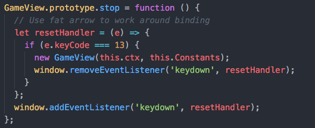
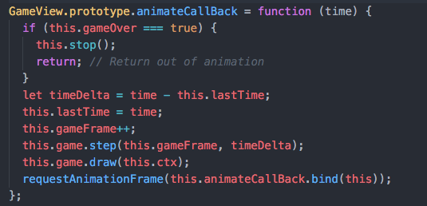
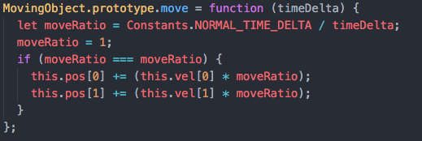
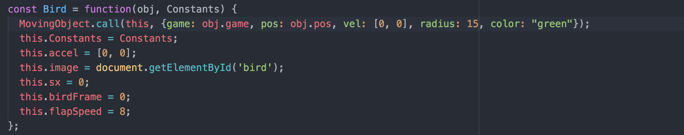
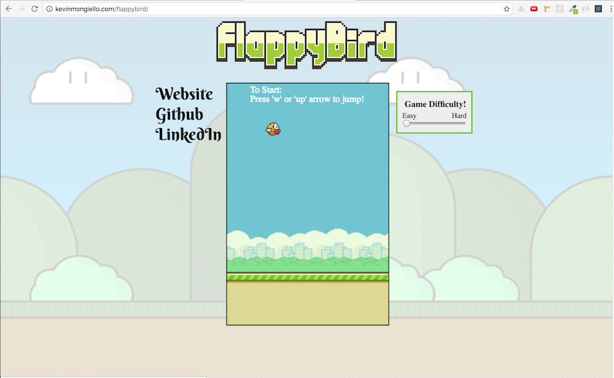
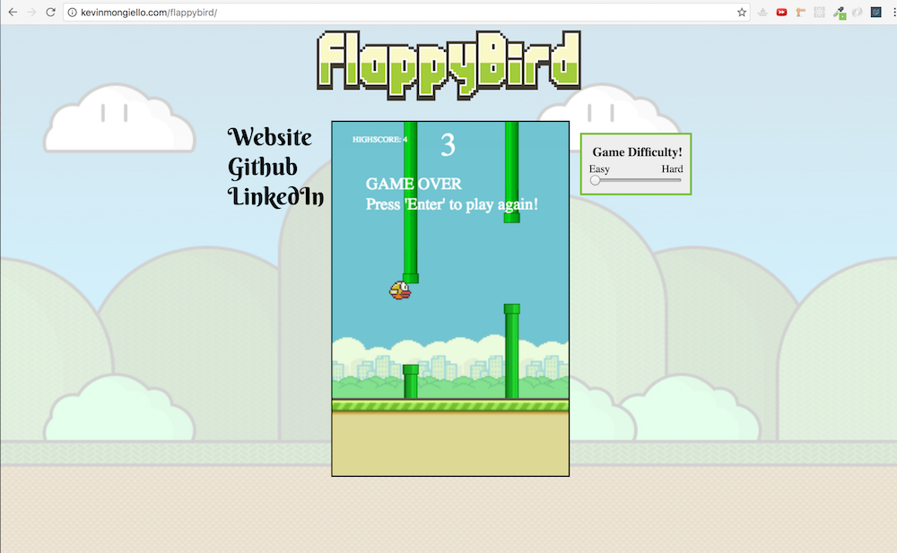

# Flappy Bird

[live][flappy-bird]
[flappy-bird]: http://www.kevinmongiello.com/flappybird

Flappy Bird is a browser game built in pure Javascript and HTML Canvas.  The objective is simple: Use the keys 'w' and 'up arrow' to fly between the pipes for as long as you can.  When the game ends, simply follow the instructions and press 'enter' to play again.  Check your high-score in the top-left corner. If you think the game is too hard, (or too easy), just use the slider on the right of the game window to change the difficulty.

### Technical

**General**

The top-level file extracts the canvas DOM element and passes its 2D-context down to the GameView to be further passed down to the Game and its components.  The Canvas context allows each object the ability to render itself each frame after their position has been updated based on their position coordinates.  To make modifying the settings easier, a collection of pertinent game constants have been abstracted into the `game-constants` file.  Similarly to the way the Canvas context is shared, the constants have been imported near the root of the file tree and passed to each of the appropriate game members as a Constants variable.  This way, changes to the Constants object will be synchronized and will effect all dependencies equally.  In the future, I'm going to look into using a JavaScript singleton class for a simpler, cleaner solution.

**Physics & Coordinate Mapping**

Since the canvas is rendered with a width and a height, it can be mapped to a 2D cartesian plane of x,y coordinates.  All objects hold an instance variable of x,y position coordinates which can be directly associated with a pixel vector relative to Canvas' origin.  Each object simply has to update this position vector and pass that along to canvas to be rendered in the correct pixel origin on the screen.  

Since we are working with discrete quantities, the mathematical movement of objects can be derived as follows: New position is the sum of current position and current velocity.  New velocity is the sum of current velocity and current acceleration.  These calculations are performed every frame and hence the position of each object is updated accordingly.

It is important to mention that since the origin of the Canvas is in the top left hand corner, the `y` coordinate value increases down the screen.  

**Key Binding**

The GameView also handles binding the keyboard keys to keypress events in order to do things like jumping and restarting the game.  Because the method of keybinding requires the use of callback functions, function binding must be used to provide the same context in which the callback function lives.  However, this can become a problem when trying to remove a keypress event due to the fact that a bound function is no longer the same function and can no longer be identified using the original function.  Therefore the following solution uses local functions to reference each other, and removes the keypress event as soon as the key is triggered.

***Local Key-Binding Removal***

**Animation**

Animation is achieved using the browsers native `requestAnimationFrame` function which fires a timed callback function.  The callback function updates the game state and then continues to call `requestAnimationFrame` again, which creates a timed loop of callbacks that update the games state about 60 times per second.  In order to heighten the user experience, requestAnimationFrame also provides an argument `time` which is used to interpolate between lag time if the computer gets delayed with things like bad connection or overload.  This allows the game to update correctly relative to the amount of time actually passed between game frames instead of relying on the frequency of frame rendering.

***Animation***

***Time Interpolation***

**Inheritance**

All moving objects including the bird, the pipes, and the ground inherit core functionality from a MovingObject class, which reduces code and keeps things DRY.  As seen in the code snippet above, the Moving Object class provides the `move` function which updates an objects own position coordinates based on its or velocity coordinates.  In addition, the Moving Object class also takes care of setting movement-related instance variables.

In the code below, the Bird constructor sends its context to MovingObject's constructor function with the parameters desired to make a new Bird.  This setups up a prototypal inheritance from MovingObject to Bird while also allowing independence of the Bird class to create its own methods.

***Inheritance***

**Collision Detection**

Collision detection is implemented by using the position and geometry of the bird and the pipes.  Every frame, the bird is checked for collisions against each pipe.  Underneath the image of the bird and the pipes are a circle and rectangles, respectively, rendered by Canvas.  Using the origin of each geometric structure and their width/radius, the detection algorithm can estimate whether or not they are close enough to touch.  If the distance between their center is much greater than their combined radius & width, then it is clearly not a collision.  However, if two shapes are within a reasonable margin between each other, a more precise calculation is performed using Pythagoreans theorem to estimate their distance apart.

**Game Play**

On load, the game begins with an instructional start screen where the user can begin when ready.

***Start Screen***

When the player has collided with a pipe, the game stops and displays a new screen with directions to restart. A notification will appear if the player has beaten their old high-score.

***Game Over Screen***
